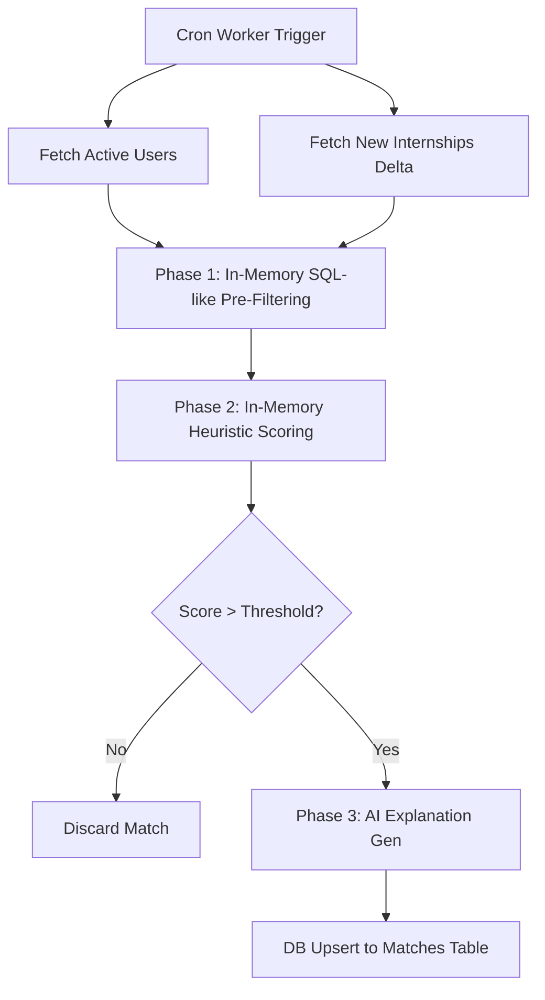

# Phase 13: Matching Engine Architecture

## 1. Overview
The Matching Engine bridges the gap between the deeply profiled user (skills, projects, preferences) and the globally extracted canonical internships. Adhering to the "Deterministic First" philosophy, the engine heavily utilizes native PostgreSQL capabilities and in-memory heuristics to perform scaleable N-to-M comparisons, reserving expensive AI generation exclusively for high-value explanation generation.

## 2. Matching Pipeline Diagram

## 3. Deterministic-First Strategy
To avoid a combinatorial explosion (comparing 10,000 internships against 1,000 users), the matching engine uses a strict multi-pass filter:

1. **Pre-Filtering (The Net):** 
   Utilize fast array overlaps (`tags` vs `profile_skills`) and text matching to rapidly eliminate incompatible internships. If a user only wants "Remote" and the internship is "Onsite", the engine excludes it immediately.
2. **Heuristic Scoring (The Sieve):**
   Execute deterministic algorithms (TF-IDF, Levenshtein distance, or simple keyword density mapping) to score the overlap between a user's `profile_projects.technologies` and the `internships.description`. 
3. **AI Generation (The Polish):**
   Only for the top 5 highest-scoring matches per user, Google Gemini is invoked to read the user's profile and the internship description to write the personalized `explanation` column and provide a slight semantic score boost.

## 4. Matching Signals & Scoring Breakdown (0-100)

The semantic score is a weighted aggregate of multiple signals:

| Signal | Max Points | Evaluation Method | Description |
| :--- | :---: | :--- | :--- |
| **Location / Remote** | 20 | Deterministic | Exact match for remote preference (+10) and geographical location (+10). |
| **Tags Overlap** | 20 | Array Intersect | Overlap between `internships.tags` and `profile_skills`. |
| **Title Similarity** | 20 | Deterministic | Lexical distance between the user's expanded career domains and `internships.role_title`. |
| **Project Relevance** | 25 | Deterministic | Density of `profile_projects.technologies` found within the `internships.description`. |
| **AI Semantic Boost** | 15 | Gemini API | Deep contextual alignment scored by the LLM (e.g., matching implicit domain knowledge). |

## 5. Batch Processing Strategy (Avoiding N x M Bottlenecks)
To prevent O(N*M) runtime complexity and catastrophic N+1 database queries, the engine executes via an **Internship-Centric Delta Batch**:
1. The worker runs globally, not per-user.
2. **Fetch 1:** It executes exactly one query to fetch all newly discovered `internships` since the last global run.
3. **Fetch 2:** It executes exactly one query to fetch all active `search_sessions` and user profiles.
4. The worker evaluates the combinations natively in local Node.js memory, eliminating the latency and connection-pool exhaustion of making thousands of database round-trips.

## 6. Required Database Indexes
To support the fast delta queries, the database schema must be updated before implementation:
- **`discovered_at` Index:** **Highly Recommended.** The delta batch fundamentally relies on fetching internships by `discovered_at > X`. Without a B-Tree index on `discovered_at`, the query will trigger full-table sequential scans as the `internships` table grows.
- **`location` Index:** **Not Required for Phase 13.** Because the new batch strategy moves the core filtering into Node.js memory instead of utilizing complex SQL queries for location text matching, creating a GiST/GIN `pg_trgm` index on `internships.location` is unnecessary and can be skipped to save database overhead.

## 7. Database Write Strategy
- **Target:** `matches` table.
- **Method:** Strict Upserts.
- **Duplicate Prevention:** Using the constraint `UNIQUE (profile_id, internship_id, session_id)`, the `MatchRepository` will execute `ON CONFLICT DO UPDATE`. 
- **Update Logic:** If a match is regenerated, the system updates `semantic_score` and `explanation`, but preserves `user_feedback` so that a user's "Saved" or "Applied" status is never overwritten by a background worker cycle.

## 8. Future Scaling Considerations
As the platform scales to 10,000+ users, the following optimizations will become critical but are explicitly deferred from the Phase 13 scope:
- **Match Table Retention (TTL):** An unbounded `matches` table will explode over time (e.g., 3M+ rows per month). A background pg_cron job will eventually be needed to delete ignored matches older than 30 days.
- **Dead Tuple Vacuuming:** The `ON CONFLICT DO UPDATE` strategy natively generates dead tuples in PostgreSQL. In the future, the worker loop should be optimized with an anti-join or memory check to strictly prevent identical matches from executing empty updates, reducing autovacuum bloat.

## 9. Future Gemini Integration Points
While the base system only uses Gemini for the `explanation` string, the architecture supports:
- **Implicit Skill Extraction:** Before matching, Gemini reads the user's unstructured `profile_projects.description` to extract hidden skills into the DB.
- **Cover Letter Generation:** Once a match is marked as `saved`, a webhook triggers Gemini to draft a highly tailored cover letter combining the project history and internship requirements.

## 10. Implementation Roadmap
1. **Module Scaffolding:** Create `src/features/matching/services/` (MatchEngine, MatchScorer, MatchRepository).
2. **Database Migrations:** Create a Supabase migration to add a B-Tree index to `internships(discovered_at)`.
3. **Delta Loader:** Implement the memory-loader functions to fetch the 2 global core arrays (Profiles and Delta Internships).
4. **Deterministic Scorer:** Implement the 0-85 point heuristic weighting algorithm natively in TypeScript.
5. **AI Explainer:** Wire the top-N results to `GeminiService` using a strict Zod schema for `score_boost` and `explanation`.
6. **Persistence:** Hook the final output into `MatchRepository.upsertBatch()`.
